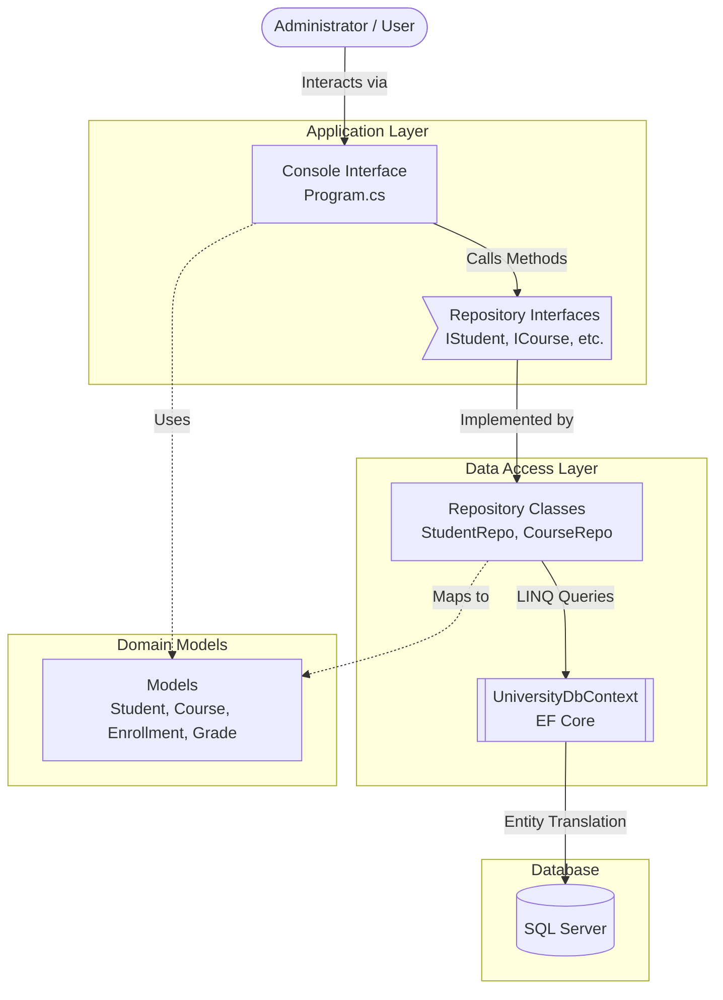

# 🎓 University Academic Management System

A robust C# Console Application built to manage university operations, including student registration, course management, enrollments, and academic grading. 

This project demonstrates clean architecture using **.NET**, **Entity Framework Core (Code-First)**, and the **Repository Pattern** to interact with a **SQL Server** database.

---

## 🏗 Architecture & Data Flow

This application is structured into distinct layers to separate the user interface from data access logic, making it highly maintainable and scalable.



---

## 🛠 Tech Stack

* **Language:** C#
* **Framework:** .NET 9.0 / 10.0 (Console Application)
* **ORM:** Entity Framework Core (EF Core)
* **Database:** Microsoft SQL Server (SSMS)
* **Architecture:** Repository Pattern

---

## ✨ Core Features

* **Student Management:** Add, update, and track student profiles.
* **Course Catalog:** Create and manage university courses.
* **Enrollment System:** Register students for active courses and manage their enrollment status.
* **Academic Records:** Record grades, generate transcripts, and track academic progress over time.

---

## 📁 Project Structure

```text
UniversityAcademicManagementSystem_Console/
│
├── Data/
│   └── UniversityDbContext.cs       # EF Core Database Context & Configuration
│
├── Models/                          # Domain Entities (Database Tables)
│   ├── AcademicRecord.cs
│   ├── Course.cs
│   ├── Enrollment.cs
│   ├── EnrollmentStatus.cs          # Enums
│   ├── Grade.cs
│   └── Student.cs
│
├── Repositories/                    # Data Access Logic
│   ├── Interfaces/                  # Contracts for data operations
│   │   ├── ICourseRepository.cs
│   │   └── IStudentRepository.cs...
│   └── Implementations/             # Concrete database queries
│       ├── CourseRepository.cs
│       └── StudentRepository.cs...
│
├── Migrations/                      # EF Core Code-First Migrations
│
├── App.config                       # Application configuration
└── Program.cs                       # Main entry point and Console UI loop
```

---

## 🚀 Getting Started

### Prerequisites
* [.NET SDK](https://dotnet.microsoft.com/download) (v9.0 or higher)
* [Visual Studio](https://visualstudio.microsoft.com/) (2022 recommended)
* [SQL Server & SSMS](https://learn.microsoft.com/en-us/sql/ssms/download-sql-server-management-studio-ssms)

### Installation & Setup

1.  **Clone the repository:**
    ```bash
    git clone [https://github.com/yourusername/UniversityAcademicManagementSystem.git](https://github.com/yourusername/UniversityAcademicManagementSystem.git)
    cd UniversityAcademicManagementSystem
    ```

2.  **Open the Solution:**
    Open `UniversityAcademicManagementSystem_Console.slnx` in Visual Studio.

3.  **Configure the Database Connection:**
    Ensure your SQL Server connection string is correctly configured. This is typically found inside `UniversityDbContext.cs` (in the `OnConfiguring` method) or pulled from an `App.config` file.
    *Example:* `Server=YOUR_SERVER_NAME;Database=UniversityDb;Trusted_Connection=True;TrustServerCertificate=True;`

4.  **Apply Database Migrations:**
    Open the **Package Manager Console** in Visual Studio (`Tools > NuGet Package Manager > Package Manager Console`) and run:
    ```powershell
    Update-Database
    ```
    *This will automatically create the `UniversityDb` database and all required tables in your SQL Server based on the existing migrations.*

5.  **Run the Application:**
    Press `F5` or click the "Start" button in Visual Studio to launch the console application.

---

## 🔒 Security & Best Practices

* **Connection Strings:** Avoid hardcoding sensitive database credentials directly into the code. In production environments, utilize environment variables, secret managers, or secure configuration files.
* **Repository Pattern:** All database operations must go through the Repositories. Do not inject `UniversityDbContext` directly into `Program.cs` to maintain clean separation of concerns.

---
*Developed as an Academic Management Solution*
